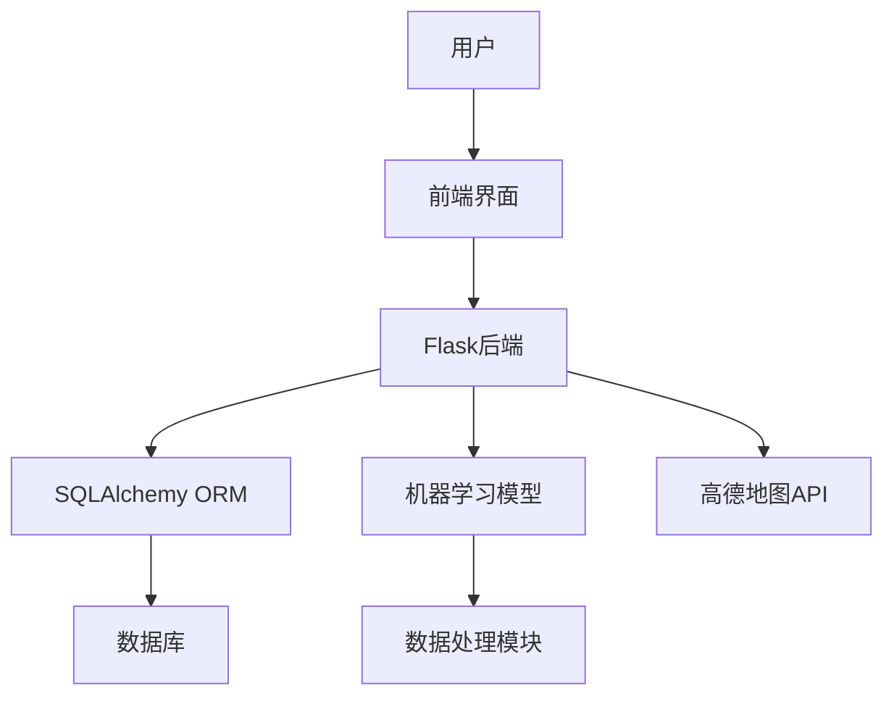
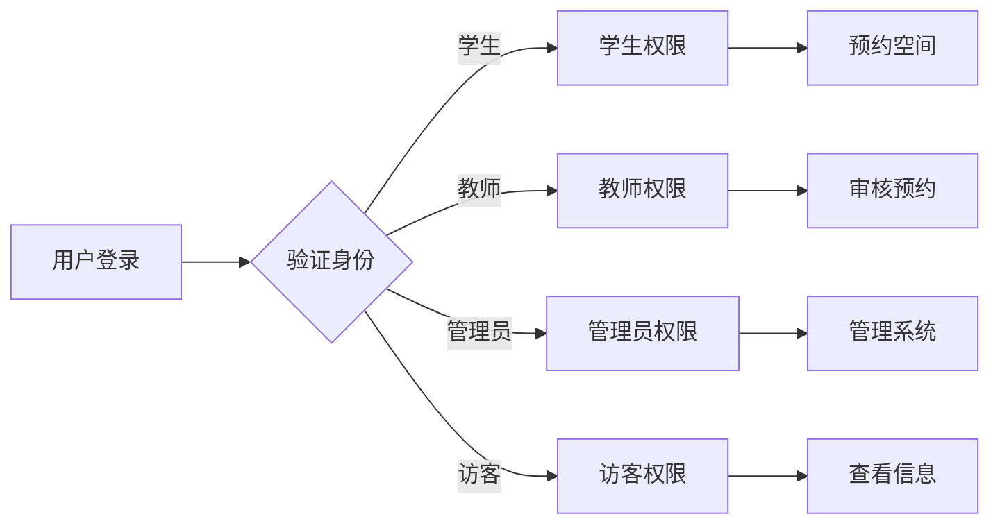
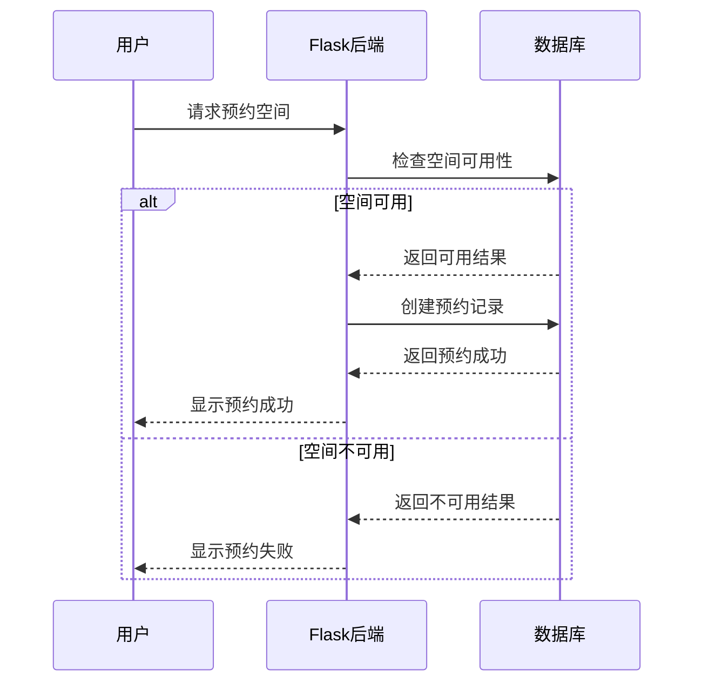

<div align="center">

# 校园数字游民地图 | Campus-Digital-Nomad-Map

### Flask full-stack campus space management with AI crowd prediction.

A multi-role campus space booking system with real-time availability and ML-based crowding forecasts.

[](LICENSE)
[](https://www.python.org/)
[](https://flask.palletsprojects.com/)
[](https://scikit-learn.org/)
[](https://lbs.amap.com/)

</div>

---

**Campus-Digital-Nomad-Map** is a **Flask full-stack** campus space-management system. It provides multi-role booking (student / teacher / admin / visitor), interactive **AMap**-based maps, and a **random-forest** model that predicts future crowding so users can pick the best time to use a space.

> [!NOTE]
> 中文项目：校园数字游民活地图——Flask 全栈 + AI 拥挤度智能预测 + 多角色权限管理。

---

## Features

- **Multi-role access control** — RBAC with 4 roles (student, teacher, admin, visitor) built on Flask-Login and custom decorators.
- **Space booking** — online reserve / cancel / modify / review with automatic conflict detection.
- **AI crowding prediction** — random-forest model (scikit-learn) forecasts crowding for the next 6 hours.
- **Interactive map** — AMap (高德) API for campus space browsing and navigation.
- **Achievements & reports** — gamified achievements and user crowd-reporting.
- **Tested** — 67 test cases across 8 modules, all passing (100%).

---

## Architecture

```
┌──────────┐   ┌──────────────┐   ┌──────────────┐   ┌───────────┐
│  User    │──▶│ Frontend     │──▶│ Flask Backend│──▶│  Database │
│  (4 roles)│  │ Bootstrap/JS │   │  SQLAlchemy  │   │ (SQLite/MySQL)
└──────────┘   └──────────────┘   │  + ML model  │   └───────────┘
                                  └──────┬───────┘
                                         │
                                   ┌─────▼─────┐
                                   │ AMap API  │
                                   └───────────┘
```

The ML pipeline: historical data → preprocessing → feature engineering → random-forest training → evaluation → deployment; real-time data runs through the same trained model for live forecasts.

---

## Database

| Table | Purpose |
|-------|---------|
| `users` | accounts & roles |
| `spaces` | campus space info (location, capacity, type) |
| `reservations` | booking records & status |
| `crowding_data` | crowding level history |
| `reports` | user-reported crowding |
| `achievements` | gamified badges |

---

## Quickstart

```bash
git clone https://github.com/Windyhhh/Campus-Digital-Nomad-Map.git
cd Campus-Digital-Nomad-Map

python -m venv venv
source venv/bin/activate        # Windows: venv\Scripts\activate
pip install -r requirements.txt

python init_db.py               # initialize database

python app.py                   # http://127.0.0.1:5000
```

For production: configure MySQL in `app.py`, run with Gunicorn (`gunicorn -w 4 -b 0.0.0.0:5000 app:app`) behind Nginx. An AMap developer key is required for map features.

---

## Project Structure

```
Campus-Digital-Nomad-Map/
├── app.py                  # Flask entry
├── init_db.py              # DB init
├── models/                 # SQLAlchemy models
├── ml/                     # random-forest model
├── templates/              # HTML views
├── static/                 # CSS / JS
└── requirements.txt
```

---


## 项目深度解析

> 以下内容提炼自项目博客 [爆款博客.md](%E7%88%86%E6%AC%BE%E5%8D%9A%E5%AE%A2.md)，完整原文请点击链接。

## 目录

## 二、场景共鸣：从校园到企业的空间管理需求

### 1. 校园场景

想象一下，在东北大学浑南校区，学生们每天面临着找自习室难、预约流程繁琐、不知道哪个时间段哪个空间人少等问题。教师们则需要管理学生预约、优先使用空间资源。管理员则需要维护用户账户、更新空间信息、监控系统运行。

### 2. 企业场景

在企业办公环境中，会议室预约、工位管理、资源调度等问题同样存在。如何提高空间利用率、优化资源配置、提升员工体验，是企业管理者面临的重要挑战。

### 3. 技术学习场景

对于技术学习者来说，如何将学到的Flask、机器学习、前端开发等知识整合到一个完整的项目中，是提升技术能力的关键。一个功能完整、文档齐全的实战项目，能够帮助学习者快速掌握全栈开发技能。

## 三、知识铺垫：核心技术栈解析

### 1. Flask框架基础

<blockquote style="border-left: 3px solid #1e88e5; padding-left: 15px; margin: 10px 0;">
**基础知识点**：Flask是一个轻量级的Python Web框架，具有灵活、易扩展、学习曲线平缓等特点。它采用了Werkzeug WSGI工具箱和Jinja2模板引擎，支持RESTful API开发和ORM集成。
</blockquote>

### 2. 机器学习入门

<blockquote style="border-left: 3px solid #1e88e5; padding-left: 15px; margin: 10px 0;">
**基础知识点**：机器学习是人工智能的一个分支，通过算法让计算机从数据中学习规律并做出预测。本项目使用scikit-learn库实现随机森林算法，用于预测校园空间的拥挤度。
</blockquote>

### 3. 多角色权限管理

<blockquote style="border-left: 3px solid #1e88e5; padding-left: 15px; margin: 10px 0;">
**基础知识点**：多角色权限管理是指根据用户角色分配不同的系统权限，实现精细化的访问控制。本项目设计了学生、教师、管理员、访客四种角色，每种角色具有不同的操作权限。
</blockquote>

## 四、技术深拆：校园数字游民活地图架构设计

### 1. 系统架构概览



**架构图解读**：系统采用前后端分离的架构设计，前端使用Bootstrap和JavaScript实现交互逻辑，后端使用Flask框架处理业务请求，通过SQLAlchemy ORM操作数据库，集成机器学习模型实现智能预测功能，并调用高德地图API实现地图展示和导航功能。

### 2. 核心模块拆解

#### 2.1 用户认证与权限管理



**模块功能**：实现用户注册、登录、权限分配和访问控制，确保不同角色的用户只能访问其权限范围内的功能。

**技术实现**：使用Flask-Login扩展实现用户认证，通过自定义装饰器实现权限控制，采用RBAC（基于角色的访问控制）模型设计权限系统。

#### 2.2 空间预约系统



**模块功能**：实现校园空间的在线预约、取消、修改和审核功能，支持自动冲突检测和预约提醒。

**技术实现**：使用SQLAlchemy实现数据模型设计，通过事务管理确保数据一致性，采用日期时间处理库实现预约时间的验证和冲突检测。

#### 2.3 AI智能预测模块

```mermaid
flowchart TD
    A[历史数据] --> B[数据预处理]
    B --> C[特征工程]
    C --> D[模型训练]
    D --> E[模型评估]
    E --> F[模型部署]
    

## 六、权威背书：项目测试与统计数据

### 1. 功能测试结果

| 测试模块 | 测试用例数 | 通过数 | 通过率 | 备注 |
|----------|------------|--------|--------|------|
| **用户系统** | 12 | 12 | **100%** | 覆盖4种角色 |
| **空间系统** | 8 | 8 | **100%** | 10个空间测试 |
| **预约系统** | 15 | 15 | **100%** | 25条预约记录 |
| **上报系统** | 6 | 6 | **100%** | 53条上报数据 |
| **权限系统** | 10 | 10 | **100%** | 权限控制验证 |
| **成就系统** | 5 | 5 | **100%** | 6个成就测试 |
| **地图展示** | 4 | 4 | **100%** | 高德地图API测试 |
| **AI预测** | 7 | 7 | **100%** | 模型训练和预测 |

### 2. 性能测试结果

| 测试指标 | 测试结果 | 达标标准 | 备注 |
|----------|----------|----------|------|
| **页面加载时间** | <2秒 | <3秒 | 首屏加载时间 |
| **API响应时间** | <200ms | <500ms | 平均响应时间 |
| **并发用户数** | 100+ | 50+ | 稳定运行 |
| **数据库查询时间** | <100ms | <200ms | 复杂查询 |

### 3. 代码统计数据

```
总代码行数:     ~8400行
Python代码:     ~1500行
HTML代码:       ~2500行
CSS代码:        ~600行
JavaScript:     ~800行
文档:           ~3000行
```

## 七、互动引导：技术思考与讨论

### 1. 开放性思考题

<blockquote style="border-left: 3px solid #43a047; padding-left: 15px; margin: 10px 0;">
**进阶技巧**：如果要将本项目的技术方案迁移到其他行业场景（如医院、商场、写字楼），核心需要调整哪些模块？为什么？
</blockquote>

### 2. 知识巩固环节

<blockquote style="border-left: 3px solid #43a047; padding-left: 15px; margin: 10px 0;">
**进阶技巧**：在实际开发中，如何进一步优化AI预测模型的准确度？请结合你的经验分享一下。
</blockquote>

### 3. 粉丝投票环节

请在评论区留言，告诉我们你最想了解的下一个技术主题：
- A. Flask全栈项目部署最佳实践
- B. 机器学习模型优化技巧
- C. 多角色权限系统设计
- D. 高德地图API高级应用

---
## License

MIT — free to use, modify and distribute.
